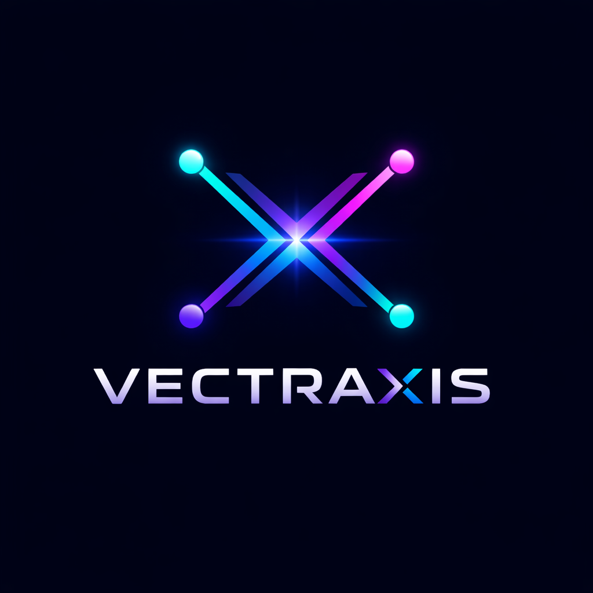

<p align="center">
  
</p>

<h1 align="center">Vectraxis</h1>

<p align="center">
  <strong>Observable agentic AI pipelines for workflow intelligence and automation</strong>
</p>

<p align="center">
  
  
  
  
  
</p>

---

Vectraxis is a multi-agent AI pipeline platform that combines RAG (Retrieval-Augmented Generation), specialized agents, validation, and observability into a unified system. Upload your data, query it with natural language, and get structured analysis, summaries, or recommendations — powered by your choice of LLM provider.

## Features

- **Multi-Provider LLM Support** — OpenAI, Anthropic (Claude), and xAI (Grok) with automatic fallback
- **Specialized Agents** — Analysis, Summarization, and Recommendation agents with task routing
- **RAG Pipeline** — Upload CSV, JSON, or text files; data is chunked, embedded, and indexed for retrieval
- **Named Prompt Management** — Create, version, and organize reusable prompt templates with system prompts, variables, JSON output schemas, and tags
- **Visual Workflow Builder** — n8n-style drag-and-drop workflow editor powered by ReactFlow; connect prompts, conditions, data sources, validators, mergers, and outputs into executable DAGs
- **Chat with Data Sources** — Conversational interface with @data_source references for filtered context retrieval
- **Validation Layer** — Structure validation, faithfulness checking, and confidence scoring
- **DB Persistence** — PostgreSQL-backed storage for data sources, prompts, and workflows with Alembic migrations
- **Observability** — Structured logging (structlog), distributed tracing (OpenTelemetry), pipeline metrics
- **Evaluation Framework** — Benchmarking and experiment tracking for pipeline quality
- **React Dashboard** — Model/provider status, query interface, file upload, prompt editor, and workflow builder

## Quick Start

### Prerequisites

- Python 3.11+
- [uv](https://docs.astral.sh/uv/) package manager
- Docker & Docker Compose
- Node.js 18+ with pnpm (for frontend)

### 1. Clone and Setup

```bash
git clone https://github.com/your-org/vectraxis.git
cd vectraxis
make setup
```

This installs all backend and frontend dependencies and creates a `.env` file from the template.

### 2. Configure API Keys (Optional)

Edit `.env` and add your API keys. All are optional — the system works without them using a fake LLM:

```env
VECTRAXIS_OPENAI_API_KEY=sk-...
VECTRAXIS_ANTHROPIC_API_KEY=sk-ant-...
VECTRAXIS_XAI_API_KEY=xai-...
```

### 3. Run Everything

```bash
make run-all
```

This starts all services in one command:

| Service | URL | Port |
|---------|-----|------|
| Dashboard | http://localhost:3000 | 3000 |
| API | http://localhost:8000 | 8000 |
| Swagger UI | http://localhost:8000/docs | 8000 |
| Scalar Docs | http://localhost:8000/scalar | 8000 |
| PostgreSQL | localhost:4343 | 4343 |

To stop everything: `make stop-all`

### Alternative: Docker Only (no local Python)

```bash
make docker-up
```

Builds and starts the API + database entirely in Docker.

### 4. Verify

```bash
# Health check
curl http://localhost:8000/api/v1/health

# List providers
curl http://localhost:8000/api/v1/providers/

# List models
curl http://localhost:8000/api/v1/models/

# Upload data
curl -F "file=@data.csv" http://localhost:8000/api/v1/ingestion/upload

# Query
curl -X POST http://localhost:8000/api/v1/query/ \
  -H "Content-Type: application/json" \
  -d '{"query": "Analyze workflow efficiency", "agent_type": "analysis"}'
```

## API Endpoints

| Method | Endpoint | Description |
|--------|----------|-------------|
| `GET` | `/api/v1/health` | Health check |
| `GET` | `/api/v1/models/` | List all models with status |
| `GET` | `/api/v1/providers/` | List all providers with status |
| `POST` | `/api/v1/query/` | Run a query through the pipeline |
| `POST` | `/api/v1/chat/` | Chat with optional @data_source references |
| `POST` | `/api/v1/ingestion/upload` | Upload and ingest a data file |
| `GET` | `/api/v1/data-sources/` | List uploaded data sources |
| `CRUD` | `/api/v1/prompts/` | Create, list, get, update, delete prompts |
| `CRUD` | `/api/v1/workflows/` | Create, list, get, update, delete workflows |
| `POST` | `/api/v1/workflows/{id}/run` | Execute a workflow DAG |
| `GET` | `/api/v1/pipelines/` | List available pipelines |
| `GET` | `/api/v1/evaluation/status` | Evaluation framework status |

API documentation is available at:
- **Swagger UI** — `http://localhost:8000/docs`
- **Scalar** — `http://localhost:8000/scalar`
- **ReDoc** — `http://localhost:8000/redoc`

## Supported Models

| Provider | Models | Env Variable |
|----------|--------|--------------|
| **OpenAI** | gpt-4o, gpt-4o-mini, gpt-4-turbo, o1, o3-mini | `VECTRAXIS_OPENAI_API_KEY` |
| **Anthropic** | claude-sonnet-4-20250514, claude-opus-4-20250514, claude-haiku-4-20250514 | `VECTRAXIS_ANTHROPIC_API_KEY` |
| **xAI** | grok-2, grok-2-mini | `VECTRAXIS_XAI_API_KEY` |

Models show as **active** when their provider's API key is set, **disabled** otherwise. Without any keys, the system uses a deterministic fake LLM for development and testing.

## Project Structure

```
vectraxis/
├── src/vectraxis/
│   ├── agents/          # LLM providers, pipeline, router, specialized agents
│   ├── api/             # FastAPI app, routers, dependency injection
│   ├── models/          # Pydantic data models (ingestion, prompt, workflow, agent)
│   ├── retrieval/       # RAG: chunking, embeddings, vector store
│   ├── ingestion/       # File loaders, normalizers, registry
│   ├── validation/      # Output validators, confidence scoring
│   ├── evaluation/      # Metrics, benchmarks, experiments
│   ├── observability/   # Logging, tracing, metrics collection
│   ├── workflows/       # DAG execution engine (topological sort, branching)
│   ├── db/              # ORM models, repositories, Alembic migrations
│   └── config.py        # Settings with .env support
├── frontend/            # React + TypeScript + Vite + ReactFlow
│   └── src/
│       ├── pages/       # PromptsPage, WorkflowsPage, WorkflowBuilderPage
│       └── components/  # NavBar, workflow nodes, config sidebar
├── tests/               # Unit and integration tests
├── docker/              # Dockerfile + docker-compose
└── pyproject.toml
```

## Development

### Make Targets

Run `make help` to see all available commands:

```
  setup               Full first-time setup (backend + frontend + .env)
  run-all             Start everything: database + API + frontend
  stop-all            Stop everything: database + API + frontend
  test                Run all unit tests
  test-cov            Run tests with coverage report
  test-integration    Run integration tests (requires DB)
  lint                Run linter
  format              Format code
  typecheck           Run type checker
  check               Run all checks: lint + format check + typecheck + tests
  docker-up           Start all services via Docker (DB + API)
  docker-down         Stop all Docker services
  docker-logs         Tail Docker logs
  clean               Remove build artifacts and caches
```

### Running Tests

```bash
make test                           # All unit tests
make test-cov                       # With coverage
make test-integration               # Integration tests (needs DB)
uv run pytest tests/unit/agents/    # Single directory
```

### Code Quality

```bash
make check    # lint + format check + tests in one command
make lint     # Ruff lint only
make format   # Ruff format only
```

## Tech Stack

**Backend:** Python 3.11, FastAPI, Pydantic, SQLAlchemy, LangChain, OpenTelemetry, structlog

**Frontend:** React 19, TypeScript, Vite, Tailwind CSS, shadcn/ui, ReactFlow (@xyflow/react)

**Infrastructure:** PostgreSQL 16 + pgvector, SQLAlchemy 2.0 (async), Alembic, Docker, uv
