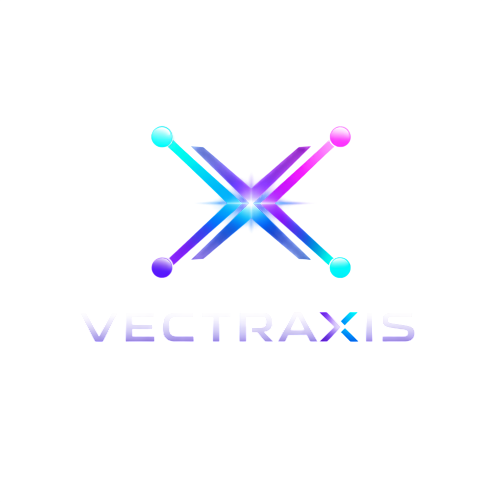

<p align="center">
  
</p>

<h1 align="center">Vectraxis</h1>

<p align="center">
  <strong>Observable agentic AI pipelines for workflow intelligence and automation</strong>
</p>

<p align="center">
  
  
  
  
  
  
</p>

<p align="center">
  
  
  
</p>

---

Vectraxis is a multi-agent AI pipeline platform that combines RAG (Retrieval-Augmented Generation), specialized agents, validation, and observability into a unified system. Upload your data, query it with natural language, and get structured analysis, summaries, or recommendations — powered by your choice of LLM provider.

Build complex AI workflows visually with a drag-and-drop editor, manage reusable prompt templates, and chat with your data sources — all from a modern React dashboard.

## Features

- **Multi-Provider LLM Support** — OpenAI, Anthropic (Claude), and xAI (Grok) with automatic fallback to a deterministic fake LLM for development
- **Specialized Agents** — Analysis, Summarization, and Recommendation agents with intelligent task routing
- **RAG Pipeline** — Upload CSV, JSON, or text files; data is chunked, embedded, and indexed for semantic retrieval
- **Named Prompt Management** — Create, version, and organize reusable prompt templates with system prompts, `{{variable}}` placeholders, JSON output schemas, and tags
- **Visual Workflow Builder** — n8n-style drag-and-drop workflow editor powered by ReactFlow; connect prompts, conditions, data sources, validators, mergers, and outputs into executable DAGs
- **Chat with Data Sources** — Conversational interface with @data_source references for filtered context retrieval
- **Validation Layer** — Structure validation, faithfulness checking, and confidence scoring
- **DB Persistence** — PostgreSQL-backed storage for data sources, prompts, and workflows with Alembic migrations
- **Observability** — Structured logging (structlog), distributed tracing (OpenTelemetry), pipeline metrics
- **Evaluation Framework** — Benchmarking and experiment tracking for pipeline quality
- **React Dashboard** — Dark-themed glass morphism UI with sidebar navigation, model/provider status, query interface, file upload, prompt editor, and workflow builder

## Architecture

```
                          ┌─────────────────────────┐
                          │    React Dashboard       │
                          │  (Vite + Tailwind + RF)  │
                          └────────┬────────────────┘
                                   │ /api proxy
                          ┌────────▼────────────────┐
                          │   FastAPI (port 8000)    │
                          │   CORS + Lifespan        │
                          └────────┬────────────────┘
            ┌──────────────────────┼──────────────────────┐
            │                      │                      │
   ┌────────▼──────┐    ┌─────────▼─────┐    ┌───────────▼────────┐
   │  Query/Chat   │    │  Prompts CRUD │    │  Workflows CRUD    │
   │  Pipeline     │    │  + Versioning │    │  + DAG Execution   │
   └────────┬──────┘    └───────────────┘    └────────────────────┘
            │
   ┌────────▼──────────────────────────────────┐
   │  Pipeline.run(query, agent_type)          │
   │  1. TaskRouter → specialized Agent        │
   │  2. RAGRetriever → context chunks         │
   │  3. Agent.execute(task, context)          │
   │  4. Validator.validate(result, context)   │
   └────────┬──────────────────────────────────┘
            │
   ┌────────▼──────────────────────────────────┐
   │  Data Layer                               │
   │  PostgreSQL 16 + pgvector                 │
   │  SQLAlchemy 2.0 async + Alembic           │
   └───────────────────────────────────────────┘
```

### Protocol-Driven Design

All major components define `@runtime_checkable` Protocol classes with fake implementations for testing. Real implementations use LangChain wrappers.

| Protocol | Test Implementation | Production Implementation |
|----------|--------------------|-----------------------------|
| `LLMProvider` | `FakeLLMProvider` | `LangChainLLMProvider` |
| `EmbeddingProvider` | `FakeEmbeddingProvider` | `LangChainEmbeddingProvider` |
| `Agent` | — | `AnalysisAgent`, `SummarizationAgent`, `RecommendationAgent` |
| `VectorStore` | `InMemoryVectorStore` | — |
| `DataSourceRepository` | `InMemoryDataSourceRepository` | `PostgresDataSourceRepository` |
| `PromptRepository` | `InMemoryPromptRepository` | `PostgresPromptRepository` |
| `WorkflowRepository` | `InMemoryWorkflowRepository` | `PostgresWorkflowRepository` |

### Workflow Engine

The workflow engine executes DAGs of nodes using topological sorting (Kahn's algorithm). Supported node types:

| Node | Description |
|------|-------------|
| **Prompt** | Loads a named prompt, renders variables, calls LLM |
| **Condition** | Evaluates a field/operator/value expression, branches to true/false |
| **Data Source** | Retrieves context chunks from an uploaded data source |
| **Validator** | Runs structure or faithfulness validation |
| **Merger** | Combines multiple upstream outputs |
| **Output** | Formats the final result (JSON or text) |

## Quick Start

### Prerequisites

- Python 3.11+
- [uv](https://docs.astral.sh/uv/) package manager
- Docker & Docker Compose
- Node.js 18+ with pnpm (for frontend)

### 1. Clone and Setup

```bash
git clone https://github.com/your-org/vectraxis.git
cd vectraxis
make setup
```

This installs all backend and frontend dependencies and creates a `.env` file from the template.

### 2. Configure API Keys (Optional)

Edit `.env` and add your API keys. All are optional — the system works without them using a fake LLM:

```env
VECTRAXIS_OPENAI_API_KEY=sk-...
VECTRAXIS_ANTHROPIC_API_KEY=sk-ant-...
VECTRAXIS_XAI_API_KEY=xai-...
```

### 3. Run Everything

```bash
make run-all
```

This starts all services in one command:

| Service | URL | Port |
|---------|-----|------|
| Dashboard | http://localhost:3000 | 3000 |
| API | http://localhost:8000 | 8000 |
| Swagger UI | http://localhost:8000/docs | 8000 |
| Scalar Docs | http://localhost:8000/scalar | 8000 |
| PostgreSQL | localhost:4343 | 4343 |

> The frontend dev server on `:3000` proxies all `/api` requests to the backend on `:8000`.

To stop everything: `make stop-all`

### Alternative: Run Services Individually

```bash
make db          # Start database only
make api         # Start backend API with hot reload
make frontend    # Start frontend dev server
```

### Alternative: Docker Only (no local Python)

```bash
make docker-up   # Builds and starts API + database in Docker
```

### 4. Verify

```bash
# Health check
curl http://localhost:8000/api/v1/health

# List providers and models
curl http://localhost:8000/api/v1/providers/
curl http://localhost:8000/api/v1/models/

# Upload data
curl -F "file=@data.csv" http://localhost:8000/api/v1/ingestion/upload

# Query
curl -X POST http://localhost:8000/api/v1/query/ \
  -H "Content-Type: application/json" \
  -d '{"query": "Analyze workflow efficiency", "agent_type": "analysis"}'

# Chat with data source references
curl -X POST http://localhost:8000/api/v1/chat/ \
  -H "Content-Type: application/json" \
  -d '{"message": "Summarize trends", "data_sources": [{"data_source_id": "...", "data_source_name": "sales"}]}'

# Create a prompt
curl -X POST http://localhost:8000/api/v1/prompts/ \
  -H "Content-Type: application/json" \
  -d '{"name": "analyzer", "user_prompt_template": "Analyze: {{input}}", "tags": ["analysis"]}'
```

## API Endpoints

### Core

| Method | Endpoint | Description |
|--------|----------|-------------|
| `GET` | `/api/v1/health` | Health check |
| `GET` | `/api/v1/models/` | List all models with active/disabled status |
| `GET` | `/api/v1/providers/` | List all LLM providers with status |

### Query & Chat

| Method | Endpoint | Description |
|--------|----------|-------------|
| `POST` | `/api/v1/query/` | Run a query through the agentic pipeline |
| `POST` | `/api/v1/chat/` | Chat with optional @data_source references |

### Data Sources

| Method | Endpoint | Description |
|--------|----------|-------------|
| `POST` | `/api/v1/ingestion/upload` | Upload and ingest a CSV, JSON, or text file |
| `GET` | `/api/v1/data-sources/` | List uploaded data sources |

### Prompts (CRUD)

| Method | Endpoint | Description |
|--------|----------|-------------|
| `POST` | `/api/v1/prompts/` | Create a new prompt |
| `GET` | `/api/v1/prompts/` | List prompts (optional `?tags=t1,t2` filter) |
| `GET` | `/api/v1/prompts/{id}` | Get a prompt by ID |
| `PUT` | `/api/v1/prompts/{id}` | Update a prompt (auto-increments version) |
| `DELETE` | `/api/v1/prompts/{id}` | Delete a prompt |

### Workflows (CRUD + Execution)

| Method | Endpoint | Description |
|--------|----------|-------------|
| `POST` | `/api/v1/workflows/` | Create a new workflow |
| `GET` | `/api/v1/workflows/` | List all workflows |
| `GET` | `/api/v1/workflows/{id}` | Get a workflow by ID |
| `PUT` | `/api/v1/workflows/{id}` | Update a workflow |
| `DELETE` | `/api/v1/workflows/{id}` | Delete a workflow |
| `POST` | `/api/v1/workflows/{id}/run` | Execute a workflow DAG |

### Other

| Method | Endpoint | Description |
|--------|----------|-------------|
| `GET` | `/api/v1/pipelines/` | List available agent pipelines |
| `GET` | `/api/v1/evaluation/status` | Evaluation framework status |

API documentation is available at:
- **Swagger UI** — http://localhost:8000/docs
- **Scalar** — http://localhost:8000/scalar
- **ReDoc** — http://localhost:8000/redoc

## Supported Models

| Provider | Models | Env Variable |
|----------|--------|--------------|
| **OpenAI** | gpt-4o, gpt-4o-mini, gpt-4-turbo, o1, o3-mini | `VECTRAXIS_OPENAI_API_KEY` |
| **Anthropic** | claude-sonnet-4-20250514, claude-opus-4-20250514, claude-haiku-4-20250514 | `VECTRAXIS_ANTHROPIC_API_KEY` |
| **xAI** | grok-2, grok-2-mini | `VECTRAXIS_XAI_API_KEY` |

Models show as **active** when their provider's API key is set, **disabled** otherwise. Without any keys, the system uses a deterministic fake LLM for development and testing.

## Configuration

All configuration is managed through environment variables with the `VECTRAXIS_` prefix. Settings are loaded from `.env` using pydantic-settings.

| Variable | Default | Description |
|----------|---------|-------------|
| `VECTRAXIS_OPENAI_API_KEY` | `""` | OpenAI API key |
| `VECTRAXIS_ANTHROPIC_API_KEY` | `""` | Anthropic API key |
| `VECTRAXIS_XAI_API_KEY` | `""` | xAI API key |
| `VECTRAXIS_DEFAULT_MODEL` | `gpt-4o-mini` | Default LLM model for queries |
| `VECTRAXIS_EMBEDDING_MODEL` | `text-embedding-3-small` | Embedding model |
| `VECTRAXIS_EMBEDDING_DIMENSION` | `1536` | Embedding vector dimension |
| `VECTRAXIS_DATABASE_URL` | `postgresql+asyncpg://...` | PostgreSQL connection URL |
| `VECTRAXIS_LOG_LEVEL` | `INFO` | Log level (DEBUG, INFO, WARNING, ERROR) |
| `VECTRAXIS_DEBUG` | `false` | Debug mode |

## Project Structure

```
vectraxis/
├── src/vectraxis/
│   ├── agents/              # LLM providers, pipeline, router, specialized agents
│   │   ├── base.py          # LLMProvider & Agent protocols, FakeLLMProvider
│   │   ├── llm_providers.py # LangChain LLM wrapper
│   │   ├── pipeline.py      # Agentic pipeline orchestration
│   │   ├── provider_registry.py  # Multi-provider model catalog
│   │   ├── router.py        # Task routing to agents
│   │   └── specialized/     # AnalysisAgent, SummarizationAgent, RecommendationAgent
│   ├── api/                 # FastAPI app, routers, dependency injection
│   │   ├── app.py           # App factory, CORS, lifespan
│   │   ├── dependencies.py  # DI wiring, singletons
│   │   └── routers/         # health, query, chat, ingestion, prompts, workflows, etc.
│   ├── models/              # Pydantic data models
│   │   ├── common.py        # VectraxisModel base, generate_id
│   │   ├── agent.py         # AgentType, AgentTask, AgentResult
│   │   ├── ingestion.py     # DataSource, RawRecord, NormalizedRecord
│   │   ├── retrieval.py     # Document, Chunk, SearchResult
│   │   ├── prompt.py        # Prompt, PromptCreate, PromptUpdate
│   │   ├── workflow.py      # Workflow, WorkflowNode, WorkflowEdge, NodeType
│   │   ├── validation.py    # ValidationResult, ConfidenceScore
│   │   └── evaluation.py    # MetricResult, BenchmarkRun, ExperimentConfig
│   ├── retrieval/           # RAG: chunking, embeddings, vector store
│   ├── ingestion/           # File loaders (CSV, JSON, text), normalizers
│   ├── validation/          # Structure & faithfulness validators
│   ├── evaluation/          # Metrics, benchmarks, experiment runner
│   ├── observability/       # structlog logging, OpenTelemetry tracing, metrics
│   ├── workflows/           # DAG execution engine (topological sort, branching)
│   ├── db/                  # SQLAlchemy ORM, repository pattern, Alembic migrations
│   │   ├── base.py          # Base + TimestampMixin
│   │   ├── models.py        # DataSourceRow, PromptRow, WorkflowRow
│   │   ├── session.py       # Async session factory
│   │   ├── repositories/    # Protocol + InMemory + Postgres implementations
│   │   └── migrations/      # Alembic migration versions
│   └── config.py            # pydantic-settings with .env support
├── frontend/                # React 19 + TypeScript + Vite
│   └── src/
│       ├── App.tsx           # Main app with sidebar layout
│       ├── api.ts            # Axios API client
│       ├── pages/            # PromptsPage, WorkflowsPage, WorkflowBuilderPage
│       └── components/
│           ├── NavBar.tsx    # Collapsible sidebar navigation
│           ├── ChatPanel.tsx # Chat interface
│           └── workflow/     # ReactFlow canvas, node palette, config sidebar, custom nodes
├── tests/
│   ├── unit/                # 562 unit tests across all modules
│   │   ├── agents/          # Provider registry, pipeline, router, specialized agents
│   │   ├── api/             # All router endpoints
│   │   ├── db/              # Repository CRUD tests
│   │   ├── models/          # Pydantic model validation
│   │   ├── workflows/       # DAG engine tests (branching, merging, cycles)
│   │   ├── retrieval/       # Chunking, embeddings, vector store, RAG
│   │   ├── ingestion/       # Loaders, normalizers, registry
│   │   ├── validation/      # Validators, grounding
│   │   ├── evaluation/      # Metrics, runner, experiments
│   │   └── observability/   # Logging, tracing, metrics
│   └── integration/         # DB integration tests (requires Docker)
├── docker/
│   ├── Dockerfile           # Multi-stage Python 3.11-slim + uv
│   └── docker-compose.yml   # API + PostgreSQL 16 + pgvector
├── pyproject.toml           # Dependencies, ruff, mypy, pytest config
├── alembic.ini              # Database migration config
├── Makefile                 # 23 development commands
├── CLAUDE.md                # AI assistant project instructions
└── .env.example             # Environment variable template
```

## Development

### Make Targets

Run `make help` to see all available commands:

```
  help                Show this help
  install             Install backend dependencies
  install-frontend    Install frontend dependencies
  setup               Full first-time setup (backend + frontend + .env)
  db                  Start database (PostgreSQL + pgvector on port 4343)
  api                 Start backend API server (port 8000)
  frontend            Start frontend dev server (port 3000)
  dev                 Start API with hot reload (requires DB running)
  run-all             Start everything: database + API + frontend
  stop-all            Stop everything: database + API + frontend
  docker-up           Start all services via Docker (DB + API)
  docker-down         Stop all Docker services
  docker-build        Rebuild Docker images
  docker-logs         Tail Docker logs
  test                Run all unit tests
  test-unit           Run unit tests (alias)
  test-integration    Run integration tests (requires DB)
  test-cov            Run tests with coverage report
  lint                Run linter (ruff)
  format              Format code (ruff)
  typecheck           Run type checker (mypy strict)
  check               Run all checks: lint + format + tests
  clean               Remove build artifacts and caches
```

### Running Tests

```bash
make test                              # All 562 unit tests
make test-cov                          # With coverage report
make test-integration                  # Integration tests (needs DB)
uv run pytest tests/unit/agents/       # Single directory
uv run pytest tests/unit/agents/test_base.py::TestClass::test_method  # Single test
```

### Code Quality

```bash
make check       # lint + format check + tests in one command
make lint        # Ruff lint only (rules: E, F, I, N, UP, B, SIM, TCH)
make format      # Ruff format only (line length: 88)
make typecheck   # MyPy strict mode with pydantic plugin
```

### Database Migrations

```bash
# Run migrations
uv run alembic upgrade head

# Create a new migration
uv run alembic revision --autogenerate -m "description"

# Check migration status
uv run alembic current
```

### Pre-commit Hooks

The project includes pre-commit hooks for ruff linting/formatting and mypy type checking:

```bash
uv run pre-commit install    # Install hooks
uv run pre-commit run --all  # Run on all files
```

## Tech Stack

**Backend**
- Python 3.11 — FastAPI, Pydantic v2, SQLAlchemy 2.0 (async), Alembic
- LangChain — OpenAI, Anthropic, xAI provider integrations
- OpenTelemetry — Distributed tracing and metrics
- structlog — Structured JSON logging

**Frontend**
- React 19, TypeScript 5.9, Vite 5
- Tailwind CSS 3, shadcn/ui components
- ReactFlow (@xyflow/react) — Visual workflow builder
- Axios — API client
- Lucide — Icons

**Infrastructure**
- PostgreSQL 16 + pgvector — Vector similarity search
- Docker & Docker Compose — Containerized deployment
- uv — Fast Python package management
- pnpm — Frontend package management
- ruff — Linting and formatting
- mypy — Static type checking (strict mode)

## License

MIT
